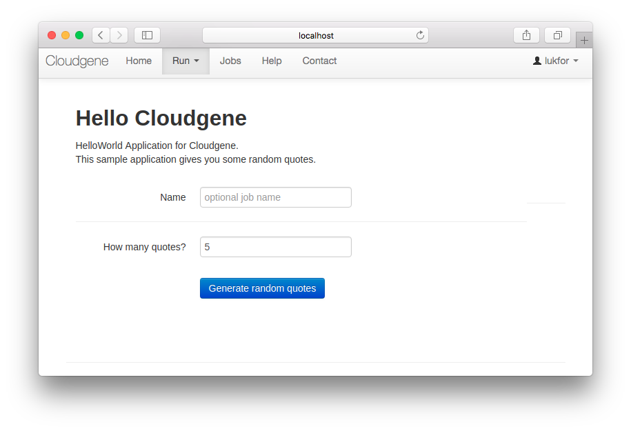
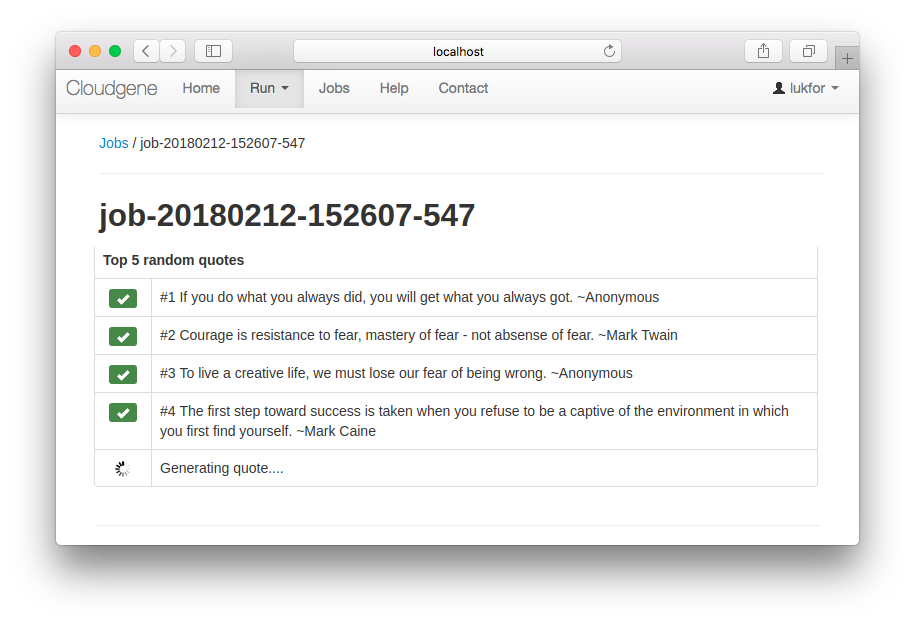

Cloudgene
=========

[](https://travis-ci.org/genepi/cloudgene) [](https://GitHub.com/genepi/cloudgene/releases/)


A framework to build Software As A Service (SaaS) platforms for data analysis pipelines.

## Features

- :wrench: **Build** your analysis pipeline in your favorite language or use Hadoop based technologies (MapReduce, Spark, Pig)
- :page_facing_up: **Integrate** your analysis pipeline into Cloudgene by writing a simple [configuration file](http://docs.cloudgene.io/developers/introduction/)
- :bulb: **Get** a powerful web application with user management, data transfer, error handling and more
- :star: **Deploy** your application with one click to any Hadoop cluster or to public Clouds like Amazon AWS
- :cloud: **Provide** your application as SaaS to other scientists and handle thousands of jobs like a pro
- :earth_americas: **Share** your application and enable everyone to clone your service to its own hardware or private cloud instance

## Requirements

You will need the following things properly installed on your computer.

* [Java 8 or higher](http://www.oracle.com/technetwork/java/javase/downloads/jdk8-downloads-2133151.html)
* [Hadoop](http://hadoop.apache.org/) (Optional)
* [Docker](https://www.docker.com/) (Optional)
* MySQL Server (Optional)


## Installation

You can install Cloudgene via our install script:

```sh
mkdir cloudgene
cd cloudgene
curl -s install.cloudgene.io | bash
```

Test the installation with the following command:

```sh
./cloudgene version
```

We provide a [Docker image](https://github.com/genepi/cloudgene-docker) to get a full-working Cloudgene instance in minutes without any installation.


## Getting started

The *hello-cloudgene* application can be installed by using the following command:

```sh
./cloudgene github-install lukfor/hello-cloudgene
```

The webserver can be started with the following command:

```sh
./cloudgene server
```

The webservice is available on http://localhost:8082. Please open this address in your web browser and enter as username `admin` and as password `admin1978` to login.

Click on *Run* to start the application.




A job can be started by filling out the form and clicking on the blue submit button. The *hello-cloudgene* application displays several inspiring quotes:




The documentation is available at http://docs.cloudgene.io

More examples can be found in [genepi/cloudgene-examples](https://github.com/genepi/cloudgene-examples).

## Cloudgene and Genomics

See Cloudgene in action:

- [Michigan Imputation Server](https://imputationserver.sph.umich.edu)
- [mtDNA Server](https://mtdna-server.uibk.ac.at)
- [Laser Server](https://laser.sph.umich.edu)

## Developing

More about how to build Cloudgene from source can be found [here](https://github.com/genepi/cloudgene/blob/master/DEVELOPING.md).

## License

Cloudgene is licensed under [AGPL-3.0](https://opensource.org/licenses/AGPL-3.0).
