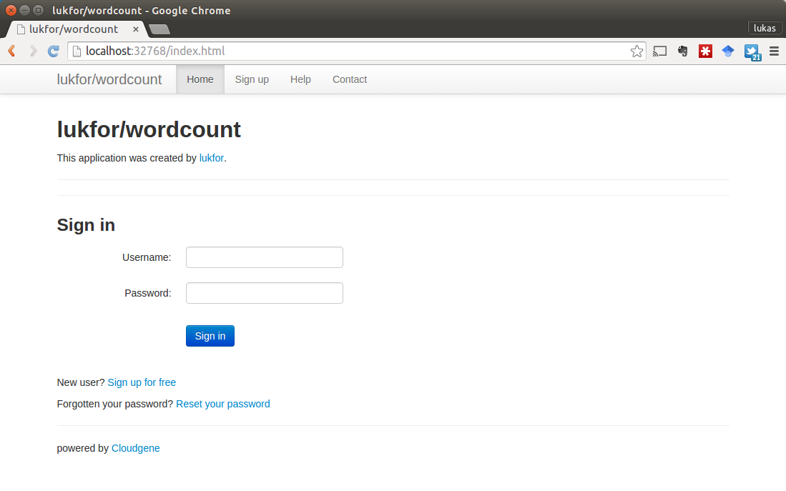

# Installing applications


## Install an application

Install applications with the `pull` command. cgapps installs all applications to `~/.cgapps`.

```bash
$ cgapps pull <app>
```

The app parameter is a shorthand name of the application and has to be in the form maintainer/application (e.g. lukfor/wordcount).

```bash
$ cgapps pull lukfor/wordcount

Download application lukfor/wordcount...
Install application lukfor/wordcount...
Pull Docker Image seppinho/mtdna-server...
Pull Docker Image seppinho/mtdna-server [DONE]
Update to version 1.1.0 successful. You can start it by typing:
  cg-apps start lukfor/wordcount
```

An online repository of all available applications and their shorthand can be found here.

---

## List all installed applications

A list of all installed applications can be shown with the `list` command:

```bash
$ cgapps list

APPLICATION                    VERSION       DEPENDENCIES        STATUS
lukfor/wordcount               0.0.4         Hadoop MRv1
lukfor/cloudburst              1.1.0         Hadoop MRv1
----------------------
```

This list prints the name and the version of an application and shows you if an application is currently running.

---

## Start an application

You can start an installed application by using the `start` command followed by the application name:

```bash
$ cgapps start lukfor/wordcount

------------------------------------------------------------------------
Starting development container for application lukfor/wordcount
------------------------------------------------------------------------
Running lukfor/wordcount in docker container seppinho/mtdna-server...
Application Mounting:
  /home/lukas/.cgapps/lukfor/wordcount/app:/opt/mtdna-server/app
  /home/lukas/.cgapps/lukfor/wordcount/config:/opt/mtdna-server/config
  /home/lukas/.cgapps/lukfor/wordcount/data:/opt/mtdna-server/data
  /home/lukas/.cgapps/lukfor/wordcount/workspace:/opt/mtdna-server/workspace
  /home/lukas/.cgapps/lukfor/wordcount/pages:/opt/mtdna-server/pages
Starting container /hopeful_sammet...
Executing initial script...
Starting container [OK]
Docker Container: /hopeful_sammet
lukfor/wordcount is listening at http://localhost:32727
```

cgapps starts the needed docker container and connects it with the selected Cloudgene application. If all works correctly, then you should see a web address on which Cloudgene is now running. In this example, Cloudgene is available on http://localhost:32727.


cgapps choose a free random port on which the web-interface is listening (in this example port 32727). If you prefer to start an application on a specific port (for example on port 8085), then you can do this by using the `--port` option:

```bash
$ cgapps start lukfor/wordcount --port 8085
```


---

## List all running applications

A list of all running applications can be shown with the `list` command:

```bash
$ cgapps list

APPLICATION                    VERSION       DEPENDENCIES        STATUS
lukfor/cloudburst              1.1.0         Hadoop MRv1
----------------------
lukfor/wordcount               0.0.4         Hadoop-MRv1         http://localhost:32720 /desperate_ritchie

```

This list prints the name and the version of an application and shows you if an application is currently running.

---

## Use an application

Open the link provided by the `start` or the `list` (e.g. http://localhost:32727) in your browser and you'll see the Cloudgene interface:



The default username of every application is __admin__ with password __admin1978__.

---

## Shutdown an application

You can stop a running application by using the `stop` command followed by the application name:

```bash
$ cgapps stop lukfor/wordcount
```

All executed jobs and created user accounts are stored outside the container. __Thus, you can restart your application anytime and can access all the created result files.__

---

## Remove an application

An installed application can be removed with the `remove` command:

```bash
$ cgapps remove lukfor/wordcount
```
---
## What's next?

Please have a look at the developer documentation or visit our application repository to explore all available Cloudgene applications.
